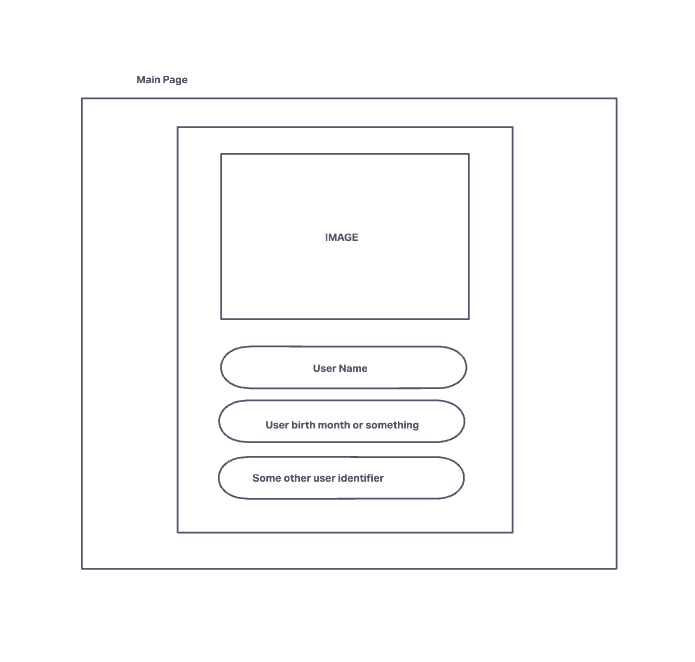
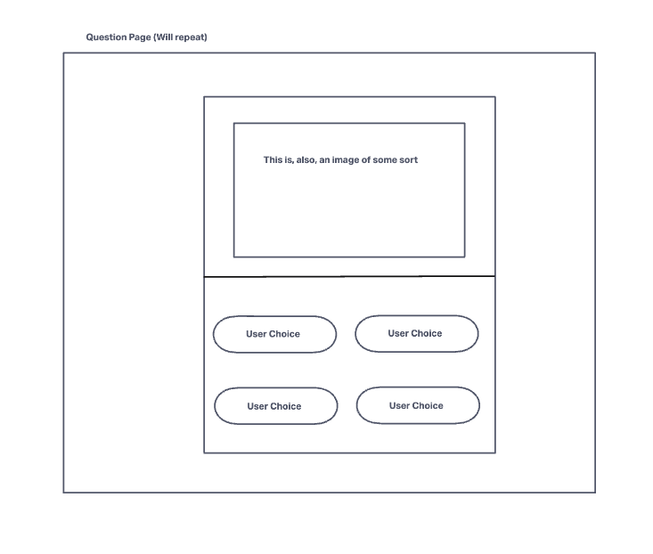
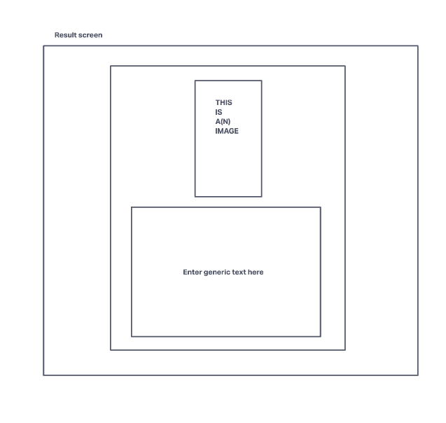

# Pokemon Personality Quiz
A browser-based personality quiz built using HTML, CSS and Javascript. Uses an API

# User Stories

- As a user, I want to find out which pokemon I am most similar to.

- As a user, I want to enter my name and birthday to make it a little more personal.

- As a user, I want my choices to matter during the questionnaire.

- As a user, I want to know more about the pokemon I am.

- As a user, I want to see my personaility as a poke nature.

# Technologies Used

- HTML 5
- CSS3
- Javascript
- Google Fonts

# Screenshots

# Getting Started

- npm-i [Click Here](https://pokenat.netlify.app/) placeholdertext

# Future Enhancements

- Add in animation ( GIFs most likely)
- Add in a "dynamic" interviewer
- Expand results to grab more pokemon
- More style
- More style again